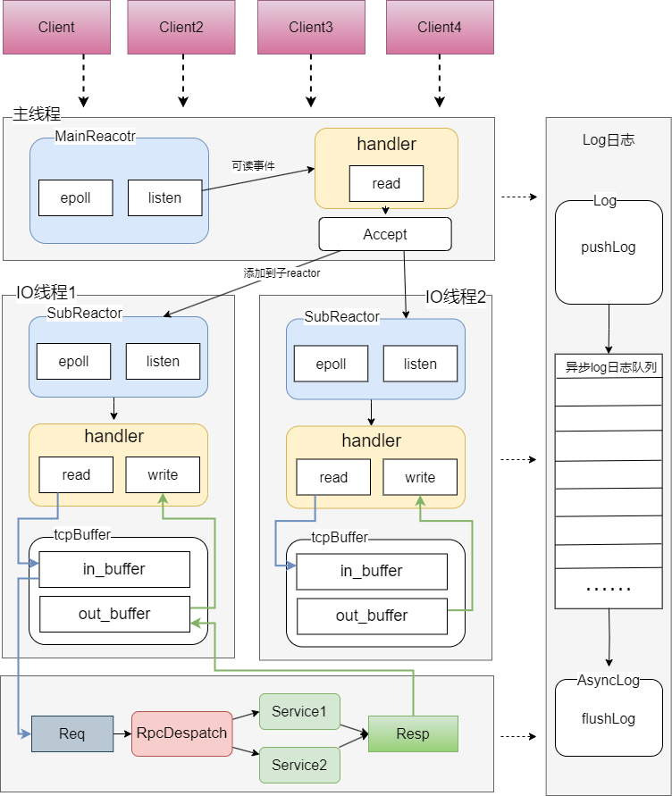
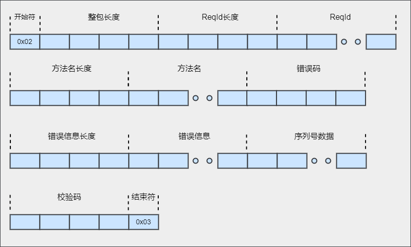

# romi-rpc

## 1.总览
Romi-RPC是一款精心打造的C++11异步远程过程调用框架，凭借其多线程设计，力求在保证代码优雅简洁的同时，实现卓越的高性能表现。该框架内核采用了主从Reactor模式，底层核心技术依赖epoll系统调用，实现在单一进程中高效地进行IO多路复用，以充分挖掘硬件潜力。

而在应用层面上，Romi-RPC创新性地基于protobuf协议定制了一套高性能RPC通信标准，并且为了兼容性和通用性考虑，亦贴心地集成了对简易HTTP协议的支持，从而满足多种应用场景需求，赋予开发者无缝对接各类服务的能力。


### 1.1 技术栈关键词
- c++11
- protobuf
- rpc
- reactor
- epoll
- http
- pthread


### 1.2项目结构
```
├─romi
|  ├─net
|  |  ├─eventloop                         // 
|  |  ├─fd_event                          // io事件
|  |  ├─fd_event_group                    // io事件组，管理fd_event
|  |  ├─io_thread                         // io线程
|  |  ├─io_thread_group                   // io线程组，管理io_thread
|  |  ├─timer                             // 定时器
|  |  ├─timer_event                       // 定时任务
|  |  ├─wakeup_fd_event                   // 唤醒事件
|  |  ├─tcp
|  |  |  ├─net_addr                       // 网络接口信息
|  |  |  ├─tcp_acceptor                   // 连接器
|  |  |  ├─tcp_buffer                     // io缓冲区
|  |  |  ├─tcp_client                     // 客户端
|  |  |  ├─tcp_connection                 // fd连接状态
|  |  |  └tcp_server                      // 服务端
|  |  ├─rpc
|  |  |  ├─rpc_channel                    // 客户端管道
|  |  |  ├─rpc_controller                 // 服务段控制器
|  |  |  ├─rpc_dispatcher                 // 服务分发器
|  |  |  └rpc_interface                   // 编解码器
|  |  ├─coder
|  |  |   ├─tinypb_coder                  // 
|  |  |   └tinypb_protocol                // rpc协议
|  ├─common
|  |   ├─config                           // 配置
|  |   ├─log                              // log日志
|  |   ├─msg_id_util                      // 
|  |   ├─run_time                         // 运行时线程状态信息
|  |   └util                              // 
├─conf
|  ├─romi.xml                             // 服务端配置
|  └rome_client.xml                       // 客户端配置
```

### 1.3项目重点
romi-rpc 是基于 C++11 开发的异步 RPC 框架，它的特点如下：

- 性能高：主从Reactor架构结合多线程并发处理，底层运用epoll多路复用技术，实现高效并行处理多个I/O连接与请求。
- 异步：支持异步RPC（远程过程调用）机制，有效提高系统并发处理能力和响应速度。
- 序列化：采用Prtobuf进行序列化处理的数据能够实现协议层面的轻量化设计，进而显著提升数据传输效率。
- 组件化：高度独立与灵活互换性，真正做到即插即用，使得系统构建与维护更为便捷且适应性强。
- 业务解耦：业务开发人员可以轻松实现开箱即用，无需深入理解或介入底层框架的具体实现细节。
- 异步日志：日志支持按日期、大小滚动；并有异步线程负责输出，提升效率
- 配置化：系统提供XML配置模块功能，确保在启动阶段自动加载所需配置文件，简化应用初始化过程


### 1.4项目架构



### 1.5rpc协议段


协议字段说明
- 开始符：固定为0x02
- 整包长度：整个包的字节数，包含开始符和结束符
- ReqID 长度：length of ReqID
- ReqID：唯一标识RPC请求，一次RPC请求和它响应的ReqID应该相同
- 方法名长度： length of 方法名字
- 方法名：RPC 方法的完整名字
- 错误码：若RPC调用发生系统异常，此错误码被设置。
- 错误码信息长度：length of 错误信息
- Protobuf 序列化数据：若Protobuf将Message对象序列后的结果
- 校验和：对整包进行校验，防止篡改。
- 结束符：固定为0x03